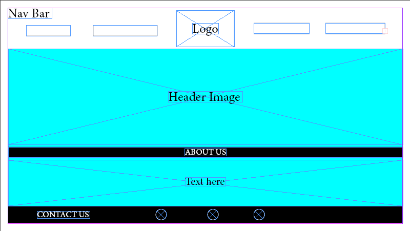
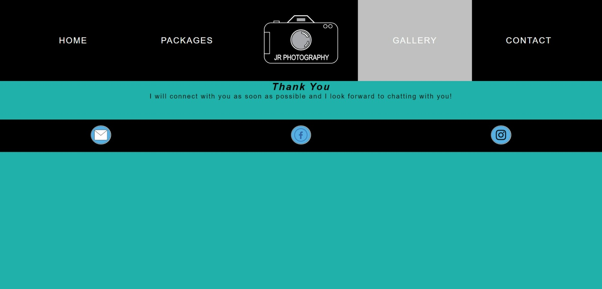

# **_JR Photography - Project Portfolio 1 - HTML & CSS_**
JR Photography is a small profesional photography business that offers a wide range of photography services. This site targets the average individual who is looking to capture their event with high quality photography, in a professional but friendly and approachable manner, with a means to see samples of work done and contact to contact the business directly.

You can view the live site here - <a href="https://jrolfe26.github.io/JR-Photography/" target="_blank"> JR Photography </a>

# Contents

* [Objective](<#objective>)
* [User Experience](<#user-experience-ux>)
    * [Target Audience](<#target-audience>)
    * [User Stories](<#user-stories>)
    * [Site Aims](<#site-aims>)
    * [Design Wireframes](<#design-wireframes>)
    * [Site Structure](<#site-structure>)
    * [Design Choices](<#design-choices>)
    *   [Colour Scheme](<#colour-scheme>)
    *   [Typography](<#typography>)
* [Features](<#features>)
    * [Navigation Menu](<#navigation-menu>)
    * [Home Page](<#home-page>)
    * [About Page](<#about-page>)
    * [Packages Page](<#packages-page>)
    * [Gallery Page](<#gallery-page>)
    * [Contact Page](<#contact-page>)
    * [Thank You Page](<#thank-you-page>)
    * [Footer](<#footer>)
* [Future Features](<#future-features>)
* [Technologies Used](<#technologies-used>)
* [Testing](<#testing>)
    * [Code Validation](<#code-validation>)
    * [Lighthouse Testing](<#lighthouse-testing>)
    * [Manual Testing](<#manual-testing>)
    * [Bugs Fixed](<#bugs-fixed>)
* [Deployment](<#deployment>)
* [Credits](<#credits>)
* [Acknowledgements](<#acknowledgements>)

# Objective

The aim of this project is to deliver a professionaly developed website for users to access a friendly but professional photography service.

[Back to top](<#contents>)

# User Experience (UX)

## Target Audience

* Users that are looking for a professional but inviting photography service to cover their event or celebration.
* Users that are looking for a professional photographer to cover their business event

## User Stories

* A user should be able to determine the site's purpose immediately
* A user should be able to easily and intuitively navigate the site
* A user should be able to identify the content of each page easily
* A user should feel comfortable contacting the business for more information or to book an event 

## Site Aims

* To provide the user with all the information needed to contact the business to book an event/photographer
* To offer a clear method to contact the business
* To sell the business to the user in a warm, friendly and inviting manner
* To provide information on the photographer
* To supply a visual portfolio of work done
* To deliver a starting guide to the cost of services

## Design Wireframes

The design and structure for this website was created in Adobe Illustrator. The designs produced were wireframes for desktop versions only. The final designs and structure differ from the wireframes due to developments during the construction of the website.

 Wireframes 

## Site Structure

JR Photography consists of 5 page website with 4 pages that the user can navigate between via the navigation bar.  The Home page is the default loading page. The Logo is centered and is also linked to the Home Page. On the left hand site of the logo are two navigation links of [Home](index.html) and [Packages](packages.html). And on the right side of the logo are another two navigation links of [Gallery](gallery.html) and [Contact](contact.html).

## Design Choices

### Colour Scheme

The final colour scheme I choose was black with white text, as well as a light sea green colour for the background on the pages. A silver colour was used on the navigation bar to highlight the active page and for the hover effect. This colour scheme is very on trend with the clean and modern look while adding some colour to the webpage.

### Typography

There were two types of fonts chosen for this website. 'EB Garamond' was used for the body of the text and 'Cormorant Garamond' for the headings, which is a slightly different version Garamond than the body text to provide emphasis. Both fonts fall back to 'sans-serif'. The Garamond fonts have a slightly luxurious feel to them and the serif detail, provides a small bit of complexity to the design but with making use of letter spacing and line heights to still keep it in line with the clean look.

[Back to top](<#contents>)

# Features

JR Photography is designed and structured like a typical website, making it very natural and intuitive to use to entice the user to explore further.

Each page, except the Home Page, has a clear heading when landing on the page and short paragraph introducing the content. The language, colour and design used is intended to be friendly and easy to understand.

## Navigation

* The navigation menu is featured at the top of the page and contains the links to main content.

* The logo is centered in the navigation bar and is clickable and links back to the homepage.

* There are three variations of the navigation bar for different screen sizes, and each keep the same colour and design styles with only the structure changing to keep the user experience as smooth as possible.

## Home Page

 * The Home Page is the landing page of the website and the first part that the user will see. It is designed to be welcoming and the purpose of the website easily determined.

 * There is a large header image chosen for its' style, colour scheme and tone to match the website itself and it's immediately visible. Overlayed on the hero image is site name and a catchy slogan.

 * There is a bit of content peeking just above the fold to show users that there is more information on the page. This is a quote and it's designed to give off a particular feel of the website to the user; essentially the ethos of by which the business stands by.

 * There is a "Meet the Photographer" section which is intended to give the user information on the waht the website is about and what the photogtraphy is like, keep the welcoming vibe whilst still imparting useful information and engaging with the user.

 * The aim of each of the above section of the Home Page is to create a feeling of welcoming and friendliness and to encourage the user to explore the website in the hopes of hitting that Contact Page.

 * Each section is fully responsive, with the multiple column content naturally falling into single column content.

 

 

Mobile Home Page

 

 

## Packages Page

* The packages page is as described in its navigation link. It lists the available services in a clear manner.

* There is a list of the available packages, using clear alternate colour design elements to distinguish the different packages, as well as headings, images and text.

* It is fully responsive and each package section contents naturally fall into a single column, with the same clear colour design elements to distinguish each package.

* This page is intended to impart the idea that this service is welcoming, friendly and the perfect fit for what the user is looking for but that the business can be approached for more information related to their particular event/occasion.

## Gallery Page

* The Gallery page provides the user with some sample photography from the photographer. It gives a mix of different events and occasions in one large gallery.

* The gallery is easy to use, with a hover function on the images drawing the users eye to the cursor.

* The Gallery page is fully responsive and as the screen reduces in size the columns of images reduce until the images are full width in mobile devices.

* Each image can be opned in it's own page when clicked on to see the image in it's full size.

Mobile Gallery Page

## Contact Page

* The Contact page should be where the user ends up. As there is no booking system or online store to purchase a package the aim is for them to reach out to the business.

*  The contact form is modelled off the usual contact form layout, with four input fields; First Name, Last Name, Email Address and Your Message.

* The contact form cannot be submitted unless the fields are filled correctly using the required attribute.

* The form also uses a GET function to link to a Thank You page to mimic the effect of actually submitting the form . There is no actual information submitted when the user completes the form and the thank you page is purely to show how the user will interact with the form.

* Beside the contact form there are practical contact details such as a dummy phone number and email. The email has a mailto link which opens to the users default mail software on their device, againing using a dummy email for the purpose of user experience.

* There is also a google map iframe beneath the Location section.

* The page is fully responsive with the sections stacking upon each other as the screen size is reduced, keeping the same design elements which distinguish between the different sections.

Mobile Contact Page

## Thank You Page

* The Thank You page cannot be accessed by the user from any links on the website. It can only be accessed by submitting the contact form on the Contact page which uses a GET function to retrieve the page to imitate the contact form submission.

* The style and design of the website is consistent, with the navigation bar on top and footer on the bottom so as to allow the user to navigate back to the main website.

## Footer

* The Footer contains the social media links.

* For better UX design, each of the social media links open in a new tab.

* The Facebook, Instagram and Youtube links are purely for the educational purposes of the website and only navigate to the home page of each of the sites.

* It also contains an email link which uses a mailto function to open the devices preferred email software. The email used is just a dummy email to show how the user interacts with the link.

[Back to top](<#contents>)

# Future Features

* I am thinking of adding stories section on the Home Page to add more to that page and give viewers more to see on the first page. I could also add a bit more interactive by making the stories be able to be rotated through so more than 3 stories can be showing at a time on the homepage.

* The gallery can be expanded whereby a lightbox function can be implemented to achieve a greate user experience and interactivity with the images.

* A Log In could be added whereby clients would have access to the photos of their event in a private gallery, will will provide a swifter service for the business, cutting out another physical meeting with clients to choose their photos.

* The mobile navigation menu could be changed into a burger menu.

* An eccomerce online shop could be added for the sale of stock prints.

# Technologies Used

* HTML5 - Delivers the structure and content for the website.
* CSS3 - Provides the styling for the website.
* [Adobe Illustrator](https://www.adobe.com/ie/products/illustrator.html) - Used to create the Logo and social media assets for the website and used to create the wireframes for the website.
* [Adobe Lightroom](https://www.adobe.com/ie/products/photoshop-lightroom.html) - Used to optimise and resize images for screen.
* Gitpod - Used to develop the website.
* GitBash - Terminal used to push changes to the GitHub repository.
* Github - Used to host and deploy the website.

[Back to top](<#contents>)

# Testing

## Code Validation

JR Photography has been validated via W3C HTML Validator and the W3C CSS Validator. There were 2 minor errors that came up for all of the pages. This was immediately corrected and documented down below in [Bugs Fixed](<#bugs-fixed>).

## Lighthouse Testing

The website was also put through Lighthouse testing via Chrome Devtools which tests a site under 4 different headings; Performance, Accessibility, Best Practices and SEO and it tests it under mobile and desktop criteria.

## Manual Testing

In addition to the automated process above, manual testing was carried out on the site as well.

* Naviagtion Menu
    * Verified that all the links link to the appropriate page with no broken links on all pages.
    * Verified that the logo when clicked links back to the Home Page.
    * Verified that the logo image has an alt text and fallback image for non browser support of the svg file.
    * Verified that the hover effects are consistent on all links.
    * Verified that the active page is highlighted.
    * Verified that the navigation bar is full responsive.

* Home Page
    * Verified that the header image on the home page is optimised and are clear enough to read.
    * Verified that all the elements are fully responsive

* Packages Page
    * Verified that all the images are optimised and have alt texts. 
    * Verified that all the elements are fully responsive.

* Gallery Page
    * Verfied all the images are optimised and have alt texts.
    * Verified that all elements are fully responsive.

* Contact Page
    * Verified that contact form cannot be submitted without the required information (First Name, Last Name and Email Address)
    * Verified that once the information is submitted via contact form, that the GET function works correctly and retrieves the thank you page.
    * Verified that the mailto function works correctly on the email link.
    * Verified that the page is fully responsive.

* Thank You Page
    * Verified that the thank you page is linked correctly to the contact form.
    * Verified that the Thank You Page is fully responsive.

* Footer
    * Verrified that the email asset links properly with the mailto function.
    * Verified that the social media links are all linked properly to the releveant social media home pages.
    * Verified that all the social media links open in a new tab.

* Browser Testing

    * JR Photography has been manually tested in Google Chrome, Microsoft Edge, Mozilla Firefox and Safari on both desktop and mobile.
    * Verified that all images worked correctly
    * Verified that design and structure was consistent across all browsers.
    * Verfied responsiveness across all browsers.

## Bugs Fixed

The errors shown were:
1. 25px is not a text-size-adjust value 
2. 20px is not a text-size-adjust value
3. Serve images in next-gen formats

* Problem 1 -20px is not a text-size-adjust value
    * I simply removed this line of text and adjusted the CSS accordingly. 

* Problem 2 - 25px is not a text-size-adjust value
    * I simply removed this line of text and adjusted the CSS accordingly. 

* Problem 3 - Serve images in next-gen formats
* I readjusted the images to WEBP format to make them load faster thus fixing the preformance issue.
### PNG Logo File

 A logo for the site was created using Adobe Illustrator and it was exported as a png file, as it was close enough in quality to SVG and the previous attempt to use SVG caused issues so I decided to go with PNG instead.
# Deployment

The website was deployed to GitHub pages via the following methods:

1. Navigate to the Settings tab in the GitHub repository for the project.
2. On the left hand side, scroll down to the pages tab.
3. Under the Source tab, choose the branch called Main and in the dropdown beside it select the folder called Root.
4. Click save.
5. The page automatically displays the deployed link at the top once save is clicked.
6. It can take up to 5 minutes to deploy.

[Back to top](<#contents>)

# Credits

* Fonts were sourced from [Google Fonts](https://fonts.google.com/)
* All images from the website were taken by myself
* Colour palette was created by [Illustrator.co](https://www.adobe.com/ie/products/illustrator.html?mv=search&ef_id=:G:s&s_kwcid=AL!3085!3!!e!!o!!adobe%20illustrator!291503341!1261140063311809&msclkid=a23445eda75e188e2c38215a6674e6df)
* Flexbox system was learned via youtube video from [LearnWebCode](https://www.youtube.com/watch?v=k32voqQhODc&ab_channel=LearnWebCode)
* Flexbox Image grid from [Kweku Adaboh](https://kweada.medium.com/css-flexbox-image-grid-for-different-sized-images-ff48cbe52ed4)
* CSS Grid code was learned via [Traversy Media](https://www.youtube.com/watch?v=jV8B24rSN5o&t=7s&ab_channel=TraversyMedia) and [CSS Tricks](https://css-tricks.com/look-ma-no-media-queries-responsive-layouts-using-css-grid/) 
* Code for CSS transform scale properties comes from [Learn with Param](https://learnwithparam.com/blog/scale-elements-on-hover-using-css/#:~:text=Often%20we%20get%20a%20requirement%20to%20scale%20images,%2F%2F%20shrinking%20in%20size.shrink%3Ahover%20%7B%20transform%3A%20scale%280.8%29%3B%20%7D)
* Code for drawing a border inside a shape/image was from [CodeLab](https://www.tutorialrepublic.com/codelab.php?topic=faq&file=draw-border-inside-div-element-with-css)
* Image optimisation was learned from [Layout, Flywheel](https://getflywheel.com/layout/optimize-images-for-web/#file-type)

[Back to top](<#contents>)

# Acknowledgements

This site, JR Photography was designed and developed in conjunction with the Full Stack Software Developer Diploma course (eccommerce) at the Code Institute. I would like to thank my mentor, my cohort facilitator, the members of our cohort, the Slack community and Code Institute for all their support.

[Back to top](<#contents>)
